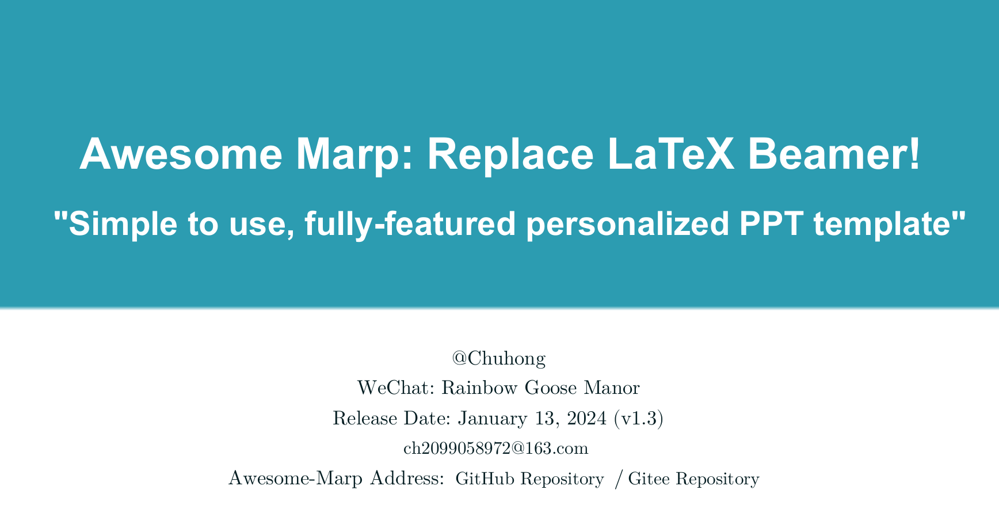

[✨ README-en](https://github.com/favourhong/Awesome-Marp/blob/main/README-en.md)、[🎉 README-zh](https://github.com/favourhong/Awesome-Marp/blob/main/README.md)

## Awesome Marp: Easily replace LaTeX Beamer!

## Why `Awesome Marp`?

I haven't made a PowerPoint presentation in over two years, ever since I learned that `Marp` can use Markdown syntax to create PPTs.

  

The built-in native theme of `Marp` has few styles and the presentation effect is not good, so I've been trying to customize the CSS file to create a theme that meets my personal aesthetics, and this template has gained a lot of popularity among several friends while I've been working on it. So I simply shared it in the hopes that it would help you in some way~ 

I gave this theme a name, `Awesome Marp`, it's kind of a stage summary. The current v1.3 version provides six themes (dark, green, blue, red, purple and brown) and 38 custom styles.

First, let's take a look at a rendering~

What's up? If you've used `Marp`'s native theme, you'll notice that `Awesome Marp` has changed a lot. Yes, I based it on Marp's `default` theme, with a few changes.

This is a pure CSS project, all effects are implemented in CSS language. Since I don't have any front-end knowledge, I'm learning as I go, and there are still a lot of things I can do to improve and optimize the code. However, completion is more important than perfection, and some small problems can be iterated and updated later. So, I decided to put `Awesome Marp` online!

## Software you need to know

There are only three: the Markdown syntax, the Markdown editor ([Visual Studio Code](https://code.visualstudio.com)、 [Obsidian](https://obsidian.md/)) and the [Marp for VScode](https://marketplace.visualstudio.com/items?itemName=marp-team.marp-vscode) plugin!

- Markdown 

- Markdown editors (e.g. VS Code, Obsidian)

- Marp

## A few features of `Awesome Marp`

- Supports 8 types of **page columns**: 2-column 5/5, 2-column 6/4, 2-column 7/3, 2-column 4/6, 2-column 3/7,  3-column 3/3，2-rows.

- Support 6 **non-nested lists of column** styles:

- Support navigation progress bar:

- Support 5 types of cover pages:

- Support 3 types of catalog pages:

- Support 5 kinds of custom "quote boxes": 

- Little easter: the link automatically adds a little tail:

- It is also possible to customize the horizontal alignment of images: center, left or right. 
	- Horizontal center alignment of images: `! [#c](. /images/a.png)`  
	- Pictures are horizontally right-aligned: `! [#r](. /images/a.png)` 
	- Pictures are horizontally left-aligned: `! [#l](. /images/a.png)`
- …… 

To summarize, there are currently 38 custom styles like the one above supported in `Awesome Marp` 1.3! To use them, you just need to specify a local directive on the page, e.g. `<! -- _class: trans -->`)

Not only that, but I've also designed 6 theme colors, and to switch between them, all you need to do is define `theme: <theme_name>` in the YAML section:

## How to use `Awesome Marp`?

- How to use:
	- **With VS Code**: Open the `Awesome-Marp` folder directly with VS Code.
		- If you want to "use it as it is", you can just follow the Markdown source files I've shared and modify them accordingly.
    
		- If you're not happy with some of the effects and want to fine-tune them, there are currently 6 CSS files under `Awesome-Marp/themes` that determine the final rendering of the Markdown source code, so you can try to change them!
		- If you are able to customize your CSS files, don't forget to add the path to your CSS files in `Awesome-Marp/.vscode/settings.json` before rendering.
	- **With Obsidian**: Install the [Marp Slides plugin](https://github.com/samuele-cozzi/obsidian-marp-slides) and configure the CSS path accordingly!
	
- Due to the concern of copyright infringement, you need to download the fonts and install them by yourself, the fonts used in Awesome Marp are:
	- Text fonts: `Latin Modern Math', `方正宋刻本秀楷简体', if not installed, `Calibri' and `楷体' will be used by default.
    - Headline fonts: `Optima LT Medium', `方正苏新诗柳楷简体', if not installed, `Arial' and `黑体' will be used by default.
    - Footnote fonts: `Charm` and `叶根友毛笔行书修正版`, if not installed, `Calibri` and `楷体` will be used by default.
    - Code fonts: `Fira Code` and `霞鹜文楷等宽`, if not installed, `Consolas` and `华文中宋` will be used by default.

## Update Record

- `January 13, 2024` Awesome Marp v1.3 
  - 38 customizable styles 
  - Add two rows of columns, character columns, etc.

- `October 16, 2023` Awesome Marp v1.2
  - 30 Custom Styles
  - Add footnote (1), adjust font size (4) and 5 custom styles based on v1.1.
  - New free fonts
- `September 26, 2023` Awesome Marp v1.1
  - 25 customizable styles
  - Add 4 custom styles based on v1.0, including Fixed Header Row (2), Page 4-6 Columns, Page 3-7 Columns (2).
- `September 24, 2023` Awesome Marp v1.0
  - 21 custom styles

